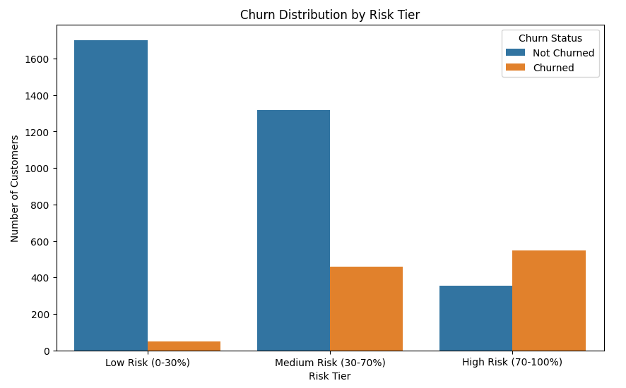
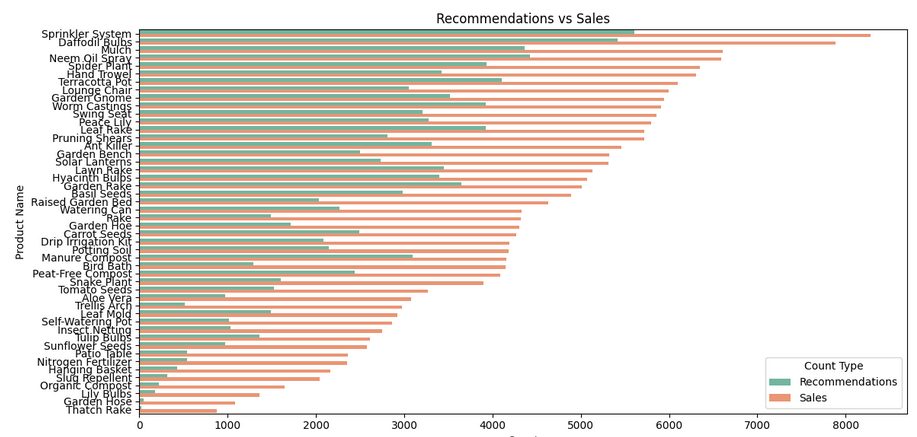
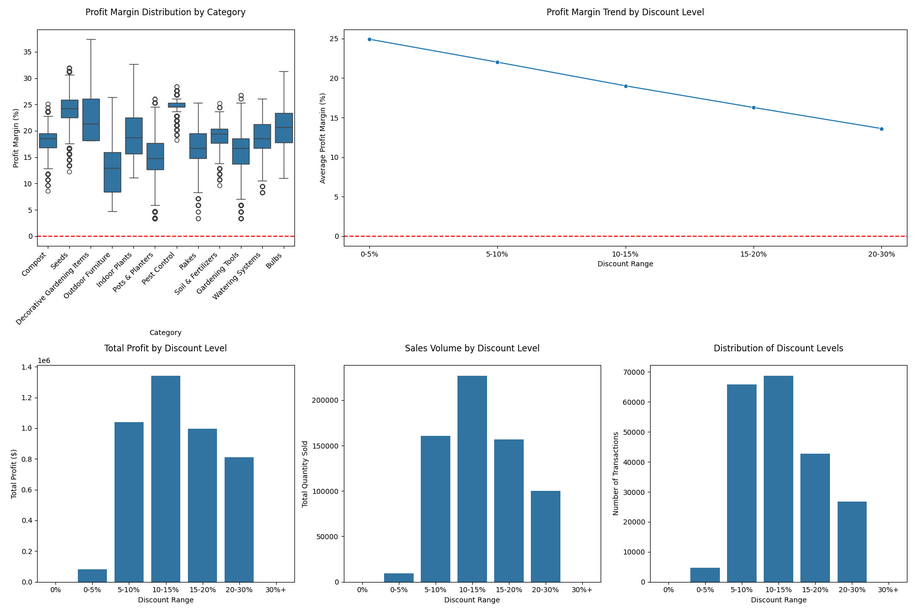
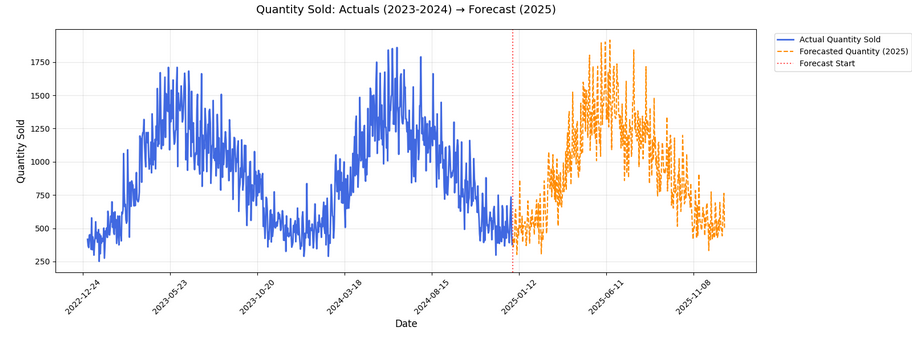
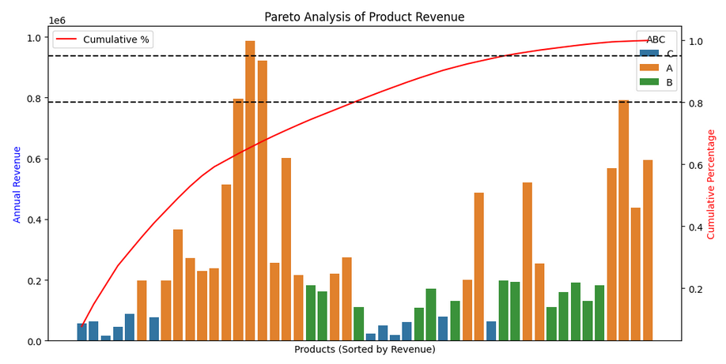

# 🌿 Botanika: Analyzing Sales Data for a Hypothetical Gardening E-Commerce Shop

Data-Driven Insights for a Simulated Gardening Business

---

## 🚀 Project Highlights

  - Built a complete end-to-end analytics pipeline using SQL, Python, and Power BI

 - Simulated 200K+ transactions across 6 European regions and 7 relational tables

  - Created realistic logic for sales, inventory, campaigns, and customer behavior
  
  - Developed advanced analytics models for churn prediction, segmentation, forecasting, and inventory optimization

  - Designed a professional Power BI dashboard to turn data into business insights

---

## 🧰 Tech Stack

🗄️ SQL (PostgreSQL) | 🐍 Python (Pandas, Scikit-learn, LightFM, XGBoost) | 📊 Power BI | 🧠 Machine Learning |

---

## 📚 Table of Contents

  1. Introduction

  2. Goals & Key Questions

  3. Synthetic Dataset & Preparation

  4. Data Quality & Preprocessing

  5. Analysis Roadmap (SQL)

  6. Advanced Analytics (Python)

  7. Interactive Dashboards & Storytelling

  8. Conclusion

  9. Next Steps

---

## 🌱 Introduction

In 2020, Botanika launched in Germany as an online shop for gardening supplies. After rapid growth, it expanded to the Netherlands, Spain, Italy, the UK, and Ireland.

This project simulates a realistic end-to-end data environment for analyzing performance, customer behavior, inventory management, marketing effectiveness, and returns.

---

## 🎯 Goals & Key Questions

### Main Goal: Increase profitability by optimizing sales, reducing costs, and improving customer satisfaction.

### Key Questions

  - Which products and regions yield the highest profit margins?

  - How can we minimize shipping and return costs?

  - Which customer segments drive the most long-term value?

  - How can marketing campaigns and inventory be optimized?

---

## 🧪 Synthetic Dataset & Preparation

### Generated Tables:
products_df, customers_df, sales_df, returns_df, campaigns_df, inventory_df, not_realized_purchases_df, inventory_snapshots_df

### Key Features

  - Seasonality by country and category

  - Popularity-based sales frequencies

  - Segmented customer behavior (retail vs. wholesale)

  - Campaign effects, stock reductions, and restocking logic

  - Realistic return probabilities by category

---

### Data Flow Overview

Synthetic Data Generation
        ↓
Data Cleaning & Validation (Python + SQL)
        ↓
Exploratory & KPI Analysis (SQL)
        ↓
Predictive Modeling & Simulations (Python)
        ↓
Interactive Visualization (Power BI)

---

## 🧼 Data Quality & Preprocessing

  - Row counts and missing value checks

  - Outlier and anomaly detection

  - Foreign key validation

  - Data type consistency

  - Region and date alignment

---

##💡 Analysis Roadmap (SQL)

### Business KPIs

  - Total revenue, profit, margin, and order counts

### Sales Performance

  - Profitability by region and category

  - Seasonal and trend analysis

### Customer Insights

  - CLV, churn rate, loyalty score analysis

  - RFM segmentation

### Inventory Efficiency

  - Inventory turnover ratio

  - Stockout & overstock rates

### Marketing Effectiveness

  - Campaign ROI, conversion rate, and budget utilization

### Returns Analysis

  - Return rates, reasons, and impact on profitability

---

## 🧠 Advanced Analytics (Python)

| Analysis Type                       | Description                                    | Example Visual                                             |
| ----------------------------------- | ---------------------------------------------- | ---------------------------------------------------------- |
| **Customer Segmentation**           | K-Means clustering with RFM metrics            |                 |
| **Churn Prediction**                | XGBoost model with SHAP feature importance     |      |
| **Recommendation Engine**           | Personalized product suggestions using LightFM |              |
| **Pricing & Campaign Optimization** | Price elasticity and uplift modeling           |          |
| **Sales Forecasting**               | Time series forecasting for demand planning    |                |
| **Inventory Optimization**          | EOQ, safety stock, reorder point simulation    |              |

---

## 📊 Interactive Dashboards & Storytelling

An interactive Power BI report with six pages:

  1. Executive Summary — Key KPIs and regional performance

  2. Sales Performance — Trends, categories, and product breakdowns

  3. Customer Insight — Segments, CLV, churn, and loyalty

  4. Inventory Efficiency — Stock levels, turnover, overstock, and stockout trends

  5. Marketing & Campaigns — ROI, reach, and conversion impact

  6. Returns & Profitability — Return rates and financial effects

🎥 Watch the short Power BI walkthrough:
👉 https://youtu.be/mG_T3N05vgo

---

## 🧩 Skills Demonstrated

  - Data Modeling & ETL (SQL + Python)

  - Data Cleaning using the CLEAN Framework

  - Advanced Analytics: Clustering, Classification, Forecasting

  - Campaign ROI and Inventory Optimization

  - Data Visualization & Storytelling with Power BI

---

## 🧠 Conclusion

This project demonstrates how synthetic data can be turned into actionable business intelligence.
It provides a scalable framework for e-commerce retailers to:

  - Optimize inventory and reduce waste

  - Personalize marketing and boost ROI

  - Improve customer retention through predictive analytics

---

## 🔮 Next Steps

  - Integrate external open-data sources for benchmarking

  - Deploy Power BI dashboard to Power BI Service

  - Add anomaly detection and real-time inventory alerting

  - Experiment with reinforcement learning for dynamic pricing

